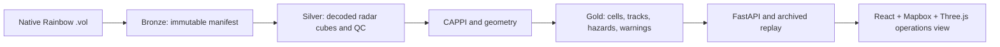

# Severe Convective Radar Intelligence

## Archived Rainbow Radar Data Platform

Severe Convective Radar Intelligence processes archived native Rainbow5 radar observations from Radar do Oeste, Chapecó, Santa Catarina, Brazil. It preserves each source file, extracts the metadata actually encoded in the archive, and provides an auditable pipeline for quality-controlled radar products, storm objects, heuristic hazard guidance, and operational serving.

The archive is the source of truth. Values not present in a Rainbow header are represented as missing/configurable; they are never silently invented. Automated hazard outputs are analytical guidance, not official meteorological warnings or tornado confirmation.

### Verified archive facts

- 2,045 native `.vol` files in a one-day archive (2026-08-30)
- 233 timestamp groups, 00:42:04–23:54:04 UTC
- Native per-moment Rainbow5 volumes: `dBZ`, `dBuZ`, `ZDR`, `KDP`, `RhoHV`, `PhiDP`, `uPhiDP`, `V`, `W`
- 14 decoded elevation slices; the embedded scan filename is not used as a sweep-count authority
- Native KDP exists, so it will not be derived by default

### Architecture



The first executable stage is the metadata inventory:

```powershell
python scripts/inspect_radar.py
python -m unittest discover -s tests -v
```

See [the file inventory](docs/radar_file_inventory.md) for provenance and verified scan facts.

### Run the validated vertical slice

```powershell
make inventory
make bronze
make quality
make silver
make cappi
make cells
make track
make hazards
make warnings
make validate
```

Serve the API with `make api`; build the React/Three.js client with `cd frontend; npm.cmd run build`.

### Data model and products

- **Bronze**: immutable, SHA-256 verified copies of every native `.vol` file.
- **Silver**: sweep-aware, ragged-range Zarr groups decoded by xradar. Raw velocity remains preserved.
- **Gold**: coverage-aware CAPPI, configurable reflectivity cells, tracks, heuristic hazard records, and GeoJSON analytical polygons.
- **Serving**: FastAPI exposes metadata, scans, volumes, CAPPI metadata, cells, tracks, warnings, and archived replay status.

### Method and limitations

Radar gates are georeferenced using configurable effective-Earth-radius beam geometry. CAPPI uses only beams within its declared height tolerance, and each product records coverage. Cell segmentation and all hazard thresholds are configurable. See [limitations](docs/limitations.md) before interpreting output.
